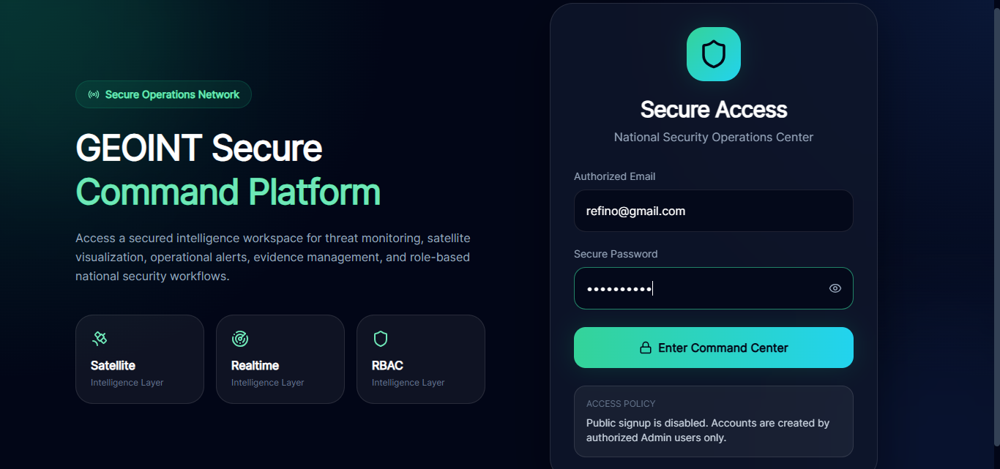
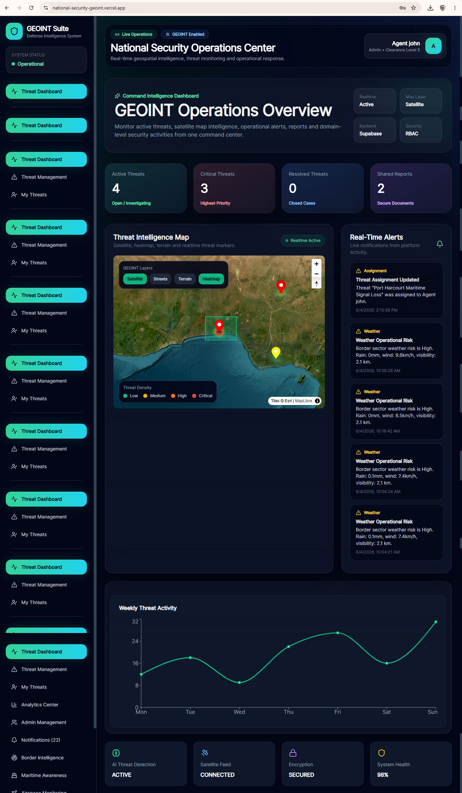
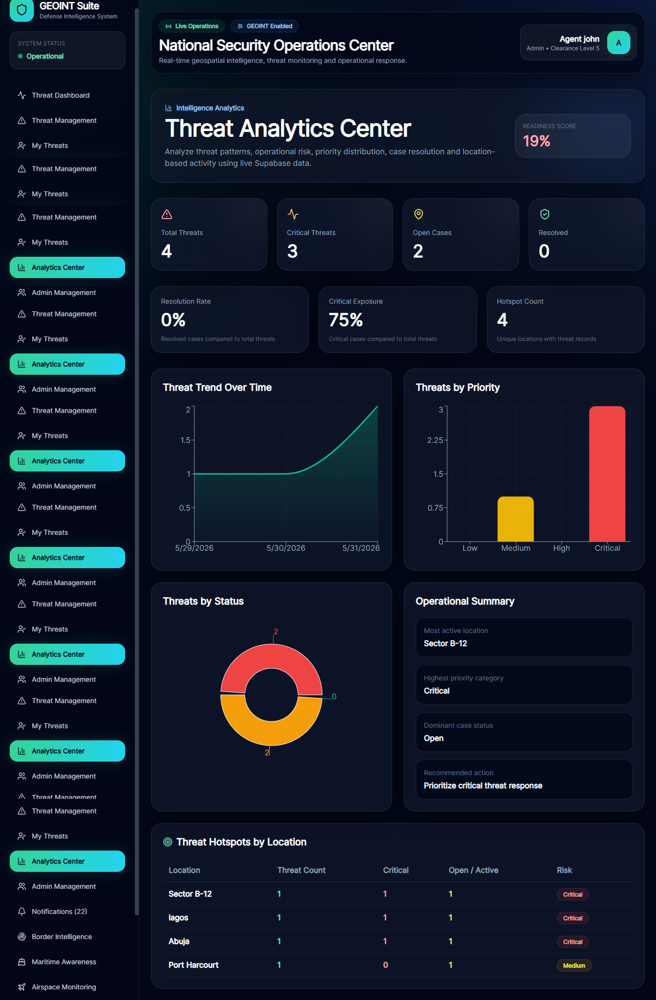
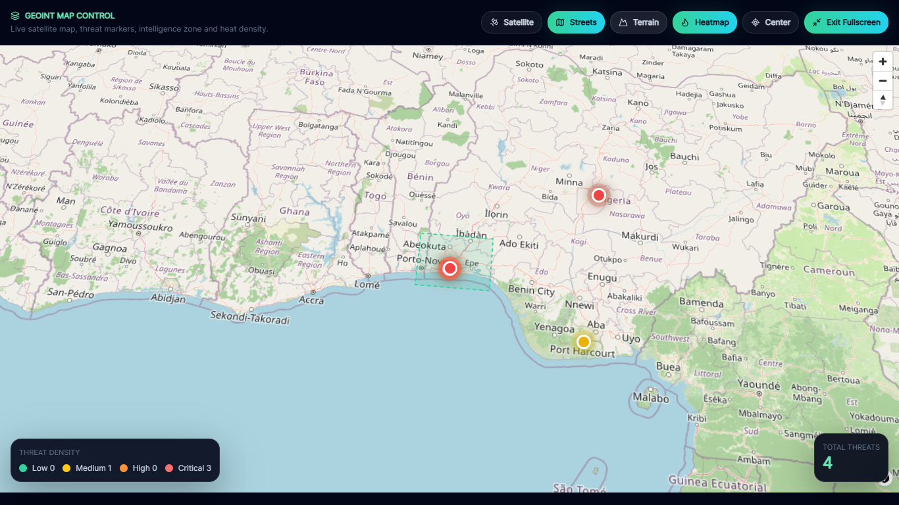

# GEOINT Secure Command Platform

A full-stack geospatial intelligence and national-security operations platform built with React, Supabase, Vercel, NASA EONET, Open-Meteo, and realtime PostgreSQL subscriptions.

## Live Demo

https://national-security-geoint.vercel.app/

## Overview

GEOINT Secure Command Platform is a web-based intelligence dashboard for monitoring threats, managing operational reports, visualizing geospatial activity, tracking audit logs, and coordinating security workflows in real time.

## Screenshots

## Key Features

- Secure login with Supabase Auth
- Role-based access control: Admin, Analyst, Viewer
- Admin-created user accounts via Supabase Edge Function
- Threat creation, assignment, status tracking, and investigation notes
- Evidence upload using Supabase Storage
- Intelligence report management and classification
- Realtime notifications with Supabase Realtime
- Audit logging for accountability
- Analytics dashboard with charts and operational metrics
- Border intelligence with NASA EONET and Open-Meteo
- Maritime, airspace, and critical infrastructure monitoring
- Responsive command-center UI

## Tech Stack

| Layer | Technology |

| Frontend | React, Vite |
| Styling | Tailwind CSS |
| Backend | Supabase |
| Database | PostgreSQL |
| Authentication | Supabase Auth |
| Storage | Supabase Storage |
| Realtime | Supabase Realtime |
| Serverless | Supabase Edge Functions |
| Deployment | Vercel |
| External Data | NASA EONET, Open-Meteo |

## Architecture

React Frontend
   |
   |-- Supabase Auth
   |-- Supabase PostgreSQL
   |-- Supabase Storage
   |-- Supabase Realtime
   |-- Supabase Edge Functions
   |
External Intelligence APIs
   |-- NASA EONET
   |-- Open-Meteo

# Roles and Permissions

Role	Permissions

Admin:	Create users, manage roles, approve reports, delete reports, manage all data
Analyst:	Create threats, upload evidence, create reports, investigate assigned cases
Viewer:	Read-only access

# Local Setup
git clone https://github.com/refino17/national-security-geoint.git
cd national-security-geoint
npm install

## Run locally:

npm run dev

## Build for production:

npm run build

# Status

Production deployed on Vercel.

# Author

Built by Promise Esemuede 
